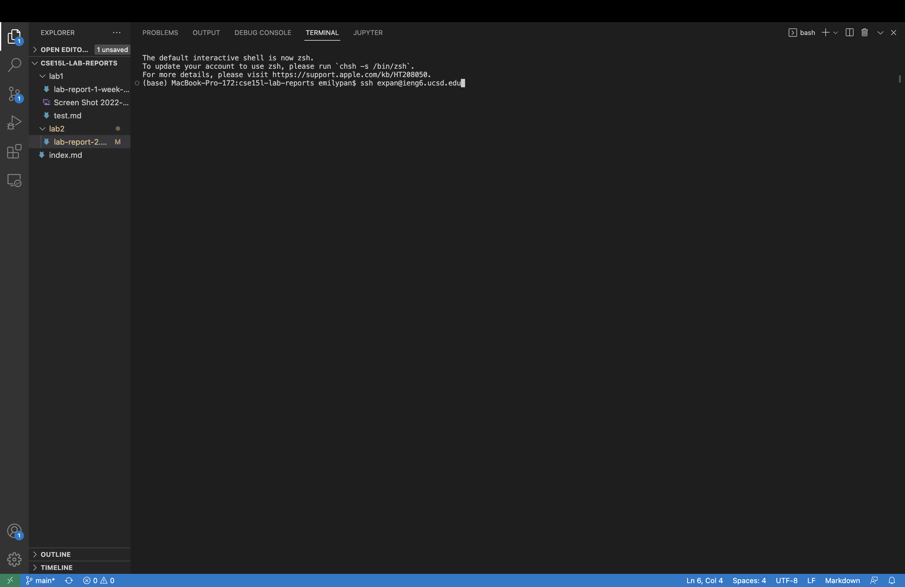

# Lab Report 2
## Installing VScode
- I did not complete this step because my computer already had VScode installed.

## Remotely Connecting
1. Open the terminal in VScode and type in `ssh expan@ieng6.ucsd.edu`. You will replace `expan` with your school username. Note: During this lab I had trouble using the course specific account so I will use expan@ieng6.ucsd.edu for this lab report.

2. Press enter and you should be logged in. Your screen should look something like this:


## Trying Some Commands
1. Try running a variety of commands. The following are just some examples of commands and what they do.
2. `ls -lat` shows a list of all files sorted by date.

3. `cat /home/linux/ieng6/cs15lfa22/public/hello.txt` The cat command reads the contents of a file, and in this case, the file is hello.txt and is located in /home/linux/ieng6/cs15lfa22/public/. The content of this file is “Hi! Welcome to CSE15L Fall 22”, which is what is printed out on the terminal.


## Moving Files with `scp`
1. In the terminal on your own computer, type `scp WhereAmI.java expan@ieng6.ucsd.edu:~/`. Replace `WhereAmI.java` with the file you want to copy over and replace `expan` with your username.
2. You can see that WhereAmI.java now runs both on my own computer and the remote server.


## Setting an SSH Key
1. In the terminal on your own computer, type `ssh-keygen`. 
2. When given the prompt `Enter file in which to save the key (/Users/joe/.ssh/id_rsa):`, press `enter`. This is what it should look like at the end:


Note that you won't have 
```
/Users/emilypan/.ssh/id_rsa already exists.
Overwrite (y/n)? n
```
because I already had the SSH key set up previously.
3. Login to the remote server, and put `mkdir .ssh` in the terminal.
4. Logout, and on your own computer run `scp /Users/emilypan/.ssh/id_rsa.pub expan@ieng6.ucsd.edu:~/.ssh/authorized_keys`, replacing `emilypan` and `expan` with your corresponding usernames.
5. Now you can `ssh` or `scp` without entering your password!

## Optimize Remote Running
1. You can experiment with optimizing remote running. The following are examples of what you can do to more efficiently run remote code:
2. You can put a command in quotes after the ssh command to do that command on the remote server and then logout of the remote server automatically.

3. You can run multiple commands on the same line by using `cp` and separating each command with a semicolon. For example: `cp WhereAmI.java OtherMain.java; javac OtherMain.java; java WhereAmI`
4. You can use the up arrow to go back to your previous commands instead of retyping it.


Good luck! :)