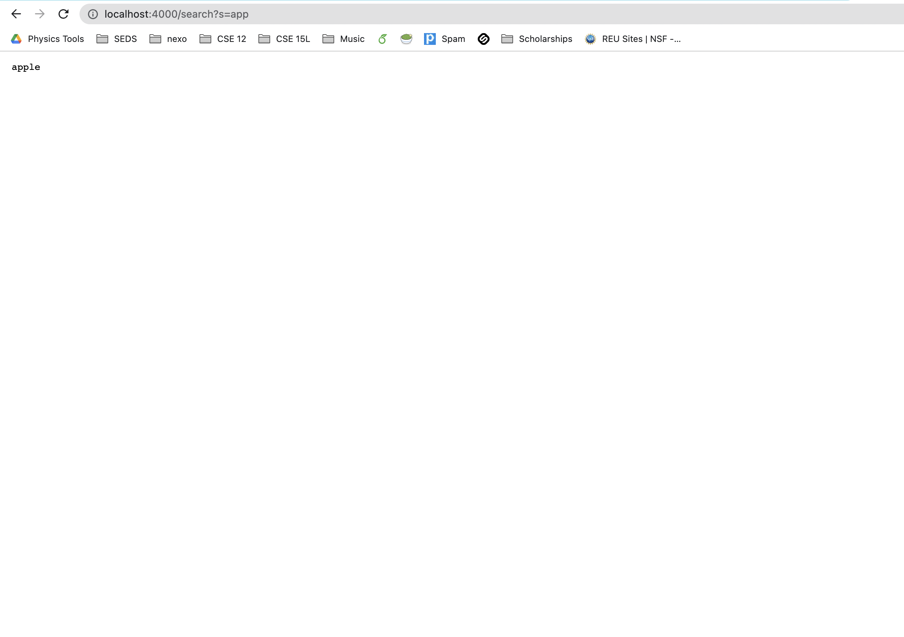

# Lab Report 2
## Part 1
**Code for Search Engine**
```
import java.io.IOException;
import java.net.URI;
import java.util.ArrayList;

class Handler implements URLHandler {

    ArrayList<String> lst = new ArrayList<String>();
    String output = "";
    public String handleRequest(URI url) {
        if (url.getPath().contains("/add")) {
            String query = url.getQuery();
            String strToAdd = query.substring(2);
            lst.add(strToAdd);
        }
        else if (url.getPath().contains("/search")) {
            String query = url.getQuery();
            String strToSearch = query.substring(2);
            for (int i = 0; i < lst.size(); i++) {
                if (lst.get(i).contains(strToSearch)) {
                    output = output + " " + lst.get(i);
                }
            }
            return output;
        }
        return "";
    }
}

class SearchEngine {
    public static void main(String[] args) throws IOException {
        if(args.length == 0){
            System.out.println("Missing port number! Try any number between 1024 to 49151");
            return;
        }

        int port = Integer.parseInt(args[0]);

        Server.start(port, new Handler());
    }
}
```

**Adding a new string**

* This calls the method `handleRequest`.
* `URI url` takes in the URL for the web server, which in this case is localhost:4000/add?s=anewstringtoadd. A relevant field is the `ArrayList<String> lst`, which is an ArrayList that stores the strings added. Before the request is processed, `lst` is empty, but after the request is done processing, `lst` now has one element that stores `anewstringtoadd` as a String.

**Adding another string**

* This calls the method `handleRequest`.
* `URI url` takes in the URL for the web server, which in this case is localhost:4000/add?s=apple. A relevant field is the `ArrayList<String> lst`, which is an ArrayList that stores the strings added. Before the request is processed, `lst` has one element `anewstringtoadd`, but after the request is done processing, `lst` has one more element at index 1 that stores `apple` as a String.

**Quering the list of strings and returning a list of strings that have a given substring**

* This calls the method `handleRequest`.
* `URI url` takes in the URL for the web server, which in this case is localhost:4000/search?s=app. A relevant field is the `ArrayList<String> lst`, which is the ArrayList that stores the strings added. The value of this field doesn't change however, because we just iterate through `lst` to return the strings containing the specified substring. 

## Part 2

