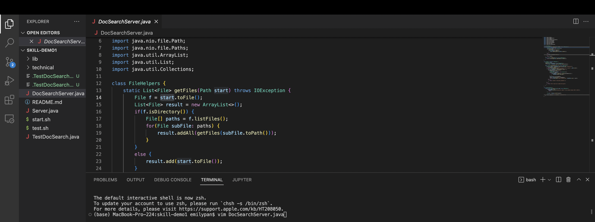
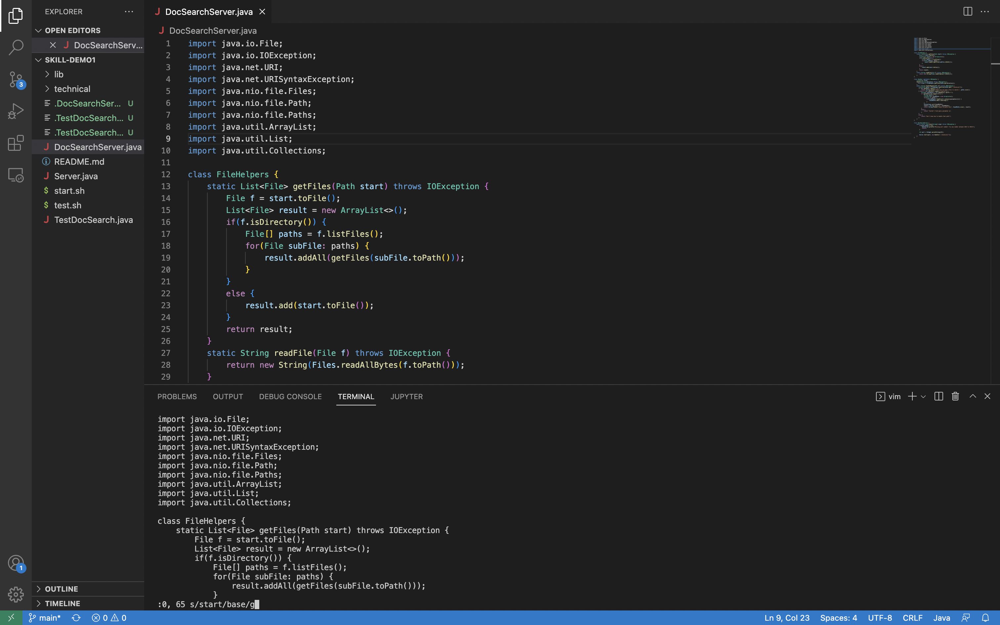
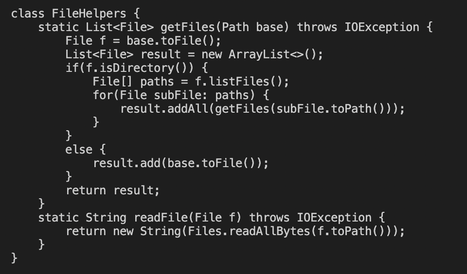
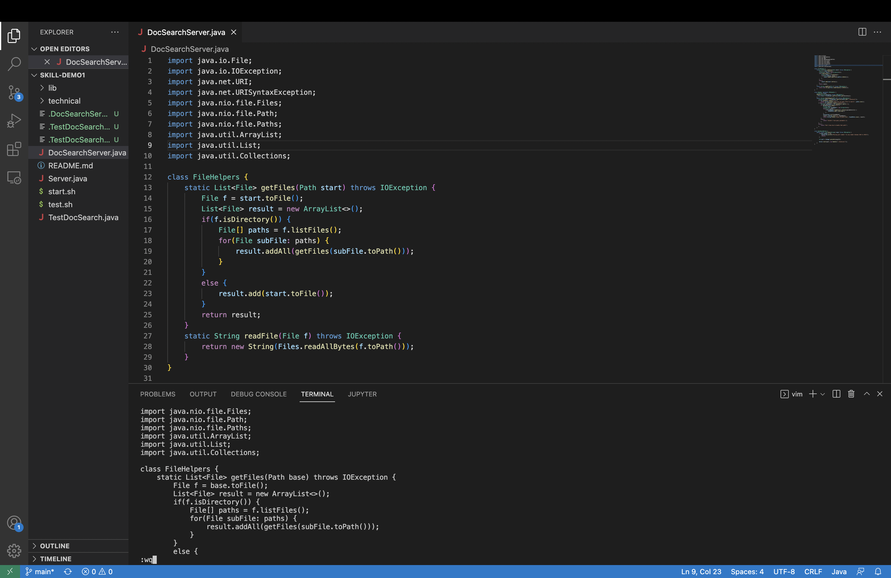
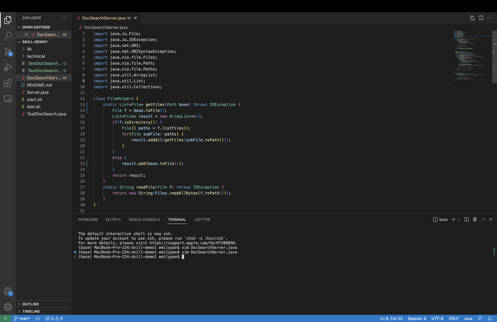

# Lab Report 4
## Part 1
Task chosen: Changing the name of the start parameter and its uses to base

1. I opened the file through vim by typing `vim DocSearchServer.java`.

2. In normal mode, I type `:0, 65 s/start/base/g <Enter>` (17 key strokes). This changes all occurrences of "start" from line 0 (inclusive) up to line 65 (exclusive) to "base".

3. In the vim editor, we see that the "start" has been changed to "base".

4. Still in normal mode, I type `:wq <Enter>`. This saves the changes and exits vim.

5. We can see the changes we made in vim updated in the java file.

## Part 2
Performing the task in Part 1 remotely using two methods:

1. It took 3m 21s to edit the file in Visual Studio Code, scp the file to the remote server, and run it there.
2. I took 1m 56s to start in an already logged in ssh session, edit the file in Vim, and run it there.

If I had to work on a program that I was running remotely, I would prefer to do it the second way. Copying the file over and then logging into the remote server takes more time, and when I first used scp, I made a mistake so I had to restart.

If I had to work with a lot of files, I would prefer to do it the second way. But if I had to make a lot of edits to one file, I would prefer to do it the first way. Making many edits still comes more naturally to me in Visual Studio Code, and using scp for one file doesn't take much time.