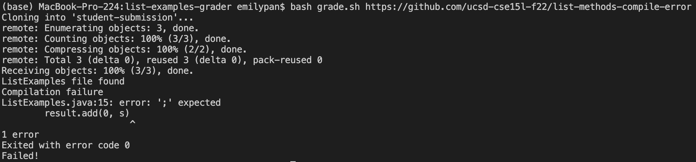

# Lab Report 5
## My grade.sh script:
```
# Credits: Parts of the implementation are developed by Ashish Jayamohan.

rm -rf student-submission
rm ListExamples.java
rm ListExamples.class
git clone $1 student-submission

FILE=student-submission/ListExamples.java
if [ -f "$FILE" ]
then
	echo "ListExamples file found"
	cp student-submission/ListExamples.java ./
	javac -cp .:lib/hamcrest-core-1.3.jar:lib/junit-4.13.2.jar *.java 2> error.txt
	if [ -s error.txt ]
	then
		echo "Compilation failure"
		echo "$(cat error.txt)"
		echo "Exited with error code $?"
        echo "Failed!"
		exit
	else
		echo "Compilation success"
		java -cp .:lib/hamcrest-core-1.3.jar:lib/junit-4.13.2.jar org.junit.runner.JUnitCore TestListExamples > output.txt
		if [ "$(grep -o E output.txt | wc -l)" != 0 ]
		then
		  echo "$(cat output.txt | tail -n2)"
          echo "Failed!"
		else
		  echo "Passed!"
		fi
	fi
else
	echo "ListExamples file not found"
    echo "Failed!"
fi
```
## Student Submission 1: https://github.com/ucsd-cse15l-f22/list-methods-lab3


## Student Submission 2: https://github.com/ucsd-cse15l-f22/list-methods-compile-error


## Student Submission 3: https://github.com/ucsd-cse15l-f22/list-methods-filename


## Tracing Student Submission 2

