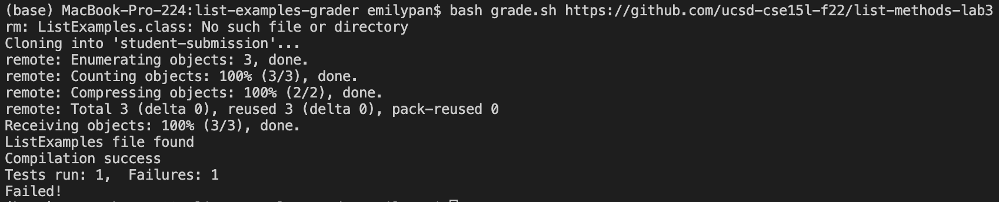

# Lab Report 5
## My grade.sh script:
```
# Credits: Parts of the implementation are developed by Ashish Jayamohan.

rm -rf student-submission
rm ListExamples.java
rm ListExamples.class
git clone $1 student-submission

FILE=student-submission/ListExamples.java
if [ -f "$FILE" ]
then
	echo "ListExamples file found"
	cp student-submission/ListExamples.java ./
	javac -cp .:lib/hamcrest-core-1.3.jar:lib/junit-4.13.2.jar *.java 2> error.txt
    ERRORCODE=$?
	if [ -s error.txt ]
	then
		echo "Compilation failure"
		echo "$(cat error.txt)"
		echo "Exited with error code $ERRORCODE"
        echo "Failed!"
		exit
	else
		echo "Compilation success"
		java -cp .:lib/hamcrest-core-1.3.jar:lib/junit-4.13.2.jar org.junit.runner.JUnitCore TestListExamples > output.txt
		if [ "$(grep -o E output.txt | wc -l)" != 0 ]
		then
		  echo "$(cat output.txt | tail -n2)"
          echo "Failed!"
		else
		  echo "Passed!"
		fi
	fi
else
	echo "ListExamples file not found"
    echo "Failed!"
fi
```
## Student Submission 1: https://github.com/ucsd-cse15l-f22/list-methods-lab3


## Student Submission 2: https://github.com/ucsd-cse15l-f22/list-methods-compile-error


## Student Submission 3: https://github.com/ucsd-cse15l-f22/list-methods-filename


## Tracing Through Student Submission 2
1. `rm -rf student-submission` has no standard output or standard error. Its return code is 0.
2. `rm ListExamples.java` has no standard output or standard error. Its return code is 0.
3. `rm ListExamples.class` has no standard output or standard error. Its return code is 0.
4. `git clone $1 student-submission` has no standard error. Its return code is 0. Its standard output is 
```
Cloning into 'student-submission'...
remote: Enumerating objects: 3, done.
remote: Counting objects: 100% (3/3), done.
remote: Compressing objects: 100% (2/2), done.
remote: Total 3 (delta 0), reused 3 (delta 0), pack-reused 0
Receiving objects: 100% (3/3), done.
```
5. `if [ -f "$FILE" ]` evaluates to true since it's checking if the file student-submission/ListExamples.java exists, which it does.
6. `echo "ListExamples file found"` has no standard error and its return code is 0. Its standard output is `ListExamples file found`. 
7. `cp student-submission/ListExamples.java ./` has no standard error or standard output. Its return code is 0.
8. `javac -cp .:lib/hamcrest-core-1.3.jar:lib/junit-4.13.2.jar *.java 2> error.txt` has no standard output and its standard error is redirected to a file called error.txt. Its return code is 1.
9. `if [ -s error.txt ]` evaluates to true since it's checking if the file error.txt has a size greater than 0, which it will have because the standard error is redirected into error.txt.
10. `echo "Compilation failure"` has no standard error and its return code is 0. Its standard output is `Compilation failure`.
11. `echo "$(cat error.txt)"` has no standard error and its return code is 0. Its standard output is 
```
ListExamples.java:15: error: ';' expected
        result.add(0, s)
                        ^
1 error
```
12. `echo "Exited with error code $ERRORCODE"` has no standard error and its return dode is 0. Its standard output is `Exited with error code 1`.
13. `echo "Failed!"` has no standard error and its return code is 0. Its standard output is `Failed!`.
14. All lines after `exit` do not run because the system has exited.